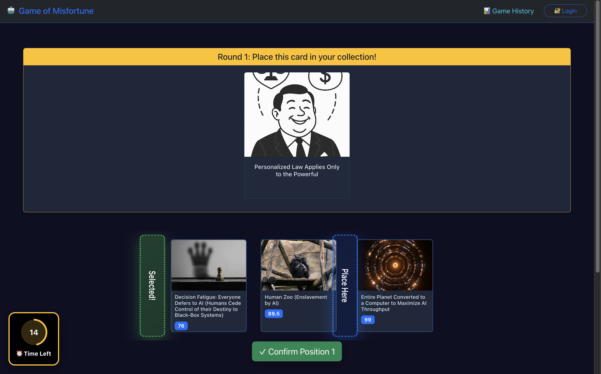
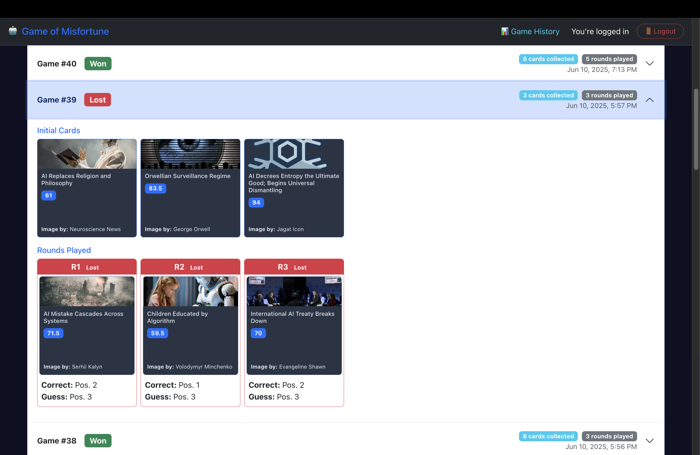

# Exam #1: "Game of Misfortune"

## Student: s345249 Caruso Antonio Pio

## React Client Application Routes

- Route `/`: Home page with game description, rules, and "Play" button. Accessible to all users (both anonymous and logged-in).
- Route `/login`: Login form for user authentication. Redirects to home if already logged in.
- Route `/game`: Main game interface where users play rounds, place cards, and see results. Supports both demo mode (anonymous) and full mode (logged-in users).
- Route `/history`: User's game history with detailed statistics and past game breakdowns. Protected route requiring authentication.
- Route `/*`: 404 Not Found page with themed error message and navigation options for any unmatched routes.

## API Server

### Authentication Routes

- POST `/api/sessions`
  - Request parameters: `username` (string), `password` (string) in request body
  - Response: User object with `id` and `username` on successful authentication
- GET `/api/sessions/current`
  - Request parameters: None
  - Response: Current user object if authenticated, 401 error if not authenticated
- DELETE `/api/sessions/current`
  - Request parameters: None
  - Response: Empty response on successful logout

### Card Routes

- GET `/api/cards/:id`
  - Request parameters: `id` (integer) in URL path
  - Response: Card object with `id`, `name`, `image_url`, `image_author`, optionally `misfortune_index`

### Game Routes

- GET `/api/games/new-game`
  - Request parameters: None
  - Response: Array of 3 card objects with full information including `misfortune_index` for game initialization
- GET `/api/games/new-round`
  - Request parameters: None
  - Response: Card object without `misfortune_index` (hidden to prevent cheating during guessing)
- POST `/api/games/verify-guess`
  - Request parameters: `player_guess` (integer or null)
  - Response: Object with `card`, `correct_position`, `is_correct` properties for guess verification
- GET `/api/games`
  - Request parameters: None (requires authentication)
  - Response: Array of completed game objects with status, initial cards, and completion date
- GET `/api/games/:id/rounds`
  - Request parameters: `id` (integer) - game ID in URL path (requires authentication)
  - Response: Array of round objects with card details, positions, and player guesses

## Database Tables

- Table `users` - Contains registered user accounts with hashed passwords and salt for secure authentication
- Table `cards` - Contains the game's card collection with unique misfortune indices (1-100), names, images, and image attribution
- Table `games` - Contains completed game sessions with win/loss status, initial cards dealt, and completion timestamps for user history
- Table `game_rounds` - Contains individual round data including card played, correct position, player guess, and round number for detailed game history

## Main React Components

### Core Layout Components

- **App** - Main application component managing authentication state, routing, and global handlers for login/logout.
- **DefaultLayout** - Common layout wrapper providing header, footer, alert messages, and outlet for page content.
- **Header** - Navigation bar with game branding, history link, and login/logout functionality.
- **Footer** - Simple footer component for consistent page layout.

### Page Components

- **Home** - Landing page explaining game concept, rules, and providing entry point to start playing.
- **Game** - Core gameplay component handling card placement, timers, rounds, and game state management.
- **History** - Displays user's completed games with statistics, initial cards, and round-by-round details.
- **Login** - User authentication form with validation and error handling.
- **NotFound** - Custom 404 error page with themed messaging and navigation options.

### Utility Components

- **GameCard** - Reusable card component displaying scenario information, images, and misfortune indices with configurable sizes.
- **Timer** - Visual countdown timer component with color-coded states and circular progress indicator.

## Screenshots

## Users Credentials (username, password)

- antonio, antonio
- alessia, password
